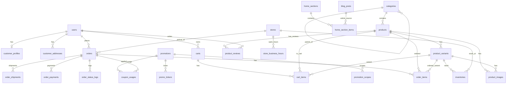

# ERD Ecommerce (Ban don gian, khong FK trong DB)

Ghi chu:
- ERD ben duoi the hien quan he logic de de hieu nghiep vu.
- File SQL chi tao bang + index, KHONG tao `FOREIGN KEY`.

## 1) Nhom nguoi dung

### users
- `id` (PK)
- `full_name`
- `email` (unique)
- `phone` (unique, nullable)
- `password_hash`
- `role` (admin, customer)
- `status` (active, inactive, banned)
- `last_login_at`
- `created_at`
- `updated_at`

### customer_profiles
- `id` (PK)
- `user_id` (logic -> users.id)
- `gender`
- `birthday`
- `tier` (new, silver, gold, vip)
- `total_spent`
- `total_orders`
- `marketing_opt_in`
- `note`
- `created_at`
- `updated_at`

### customer_addresses
- `id` (PK)
- `user_id` (logic -> users.id)
- `recipient_name`
- `recipient_phone`
- `province`
- `district`
- `ward`
- `address_line`
- `is_default`
- `created_at`
- `updated_at`

## 2) Nhom cua hang / noi dung he thong

### stores
- `id` (PK)
- `code` (unique)
- `name`
- `phone`
- `email`
- `province`
- `district`
- `ward`
- `address_line`
- `open_time`
- `close_time`
- `pickup_enabled`
- `priority_order`
- `status`
- `created_at`
- `updated_at`

### store_business_hours
- `id` (PK)
- `store_id` (logic -> stores.id)
- `weekday` (0-6)
- `open_time`
- `close_time`
- `is_closed`
- `created_at`
- `updated_at`

### site_settings
- `id` (PK)
- `setting_key` (unique)
- `setting_value`
- `setting_group`
- `description`
- `updated_by`
- `updated_at`

### footer_links
- `id` (PK)
- `group_name`
- `title`
- `url`
- `sort_order`
- `is_active`
- `created_at`
- `updated_at`

## 3) Nhom danh muc / san pham

### categories
- `id` (PK)
- `parent_id` (logic -> categories.id)
- `name`
- `slug` (unique)
- `icon_class`
- `image_url`
- `description`
- `sort_order`
- `status`
- `created_at`
- `updated_at`

### products
- `id` (PK)
- `category_id` (logic -> categories.id)
- `name`
- `slug` (unique)
- `brand`
- `description`
- `care_instructions`
- `return_policy`
- `specs_json`
- `status` (active, hidden, draft)
- `is_featured`
- `view_count`
- `rating_avg`
- `rating_count`
- `sold_count`
- `created_at`
- `updated_at`

### product_variants
- `id` (PK)
- `product_id` (logic -> products.id)
- `sku` (unique)
- `color_name`
- `size_name`
- `barcode`
- `price`
- `sale_price`
- `stock_qty`
- `weight_gram`
- `status`
- `created_at`
- `updated_at`

### inventories
- `id` (PK)
- `variant_id` (logic -> product_variants.id)
- `store_id` (logic -> stores.id, nullable)
- `on_hand_qty`
- `reserved_qty`
- `safety_stock`
- `updated_at`

### product_images
- `id` (PK)
- `product_id` (logic -> products.id)
- `variant_id` (logic -> product_variants.id, nullable)
- `image_url`
- `alt_text`
- `sort_order`
- `is_primary`
- `created_at`
- `updated_at`

### product_reviews
- `id` (PK)
- `product_id` (logic -> products.id)
- `variant_id` (logic -> product_variants.id, nullable)
- `user_id` (logic -> users.id, nullable)
- `customer_name`
- `rating` (1-5)
- `review_text`
- `status` (pending, approved, rejected)
- `created_at`
- `updated_at`

## 4) Nhom gio hang / don hang

### carts
- `id` (PK)
- `user_id` (logic -> users.id)
- `coupon_code`
- `promotion_id` (logic -> promotions.id, nullable)
- `status` (active, converted, abandoned)
- `subtotal`
- `discount_amount`
- `shipping_fee`
- `total_amount`
- `created_at`
- `updated_at`

### cart_items
- `id` (PK)
- `cart_id` (logic -> carts.id)
- `product_id` (logic -> products.id)
- `variant_id` (logic -> product_variants.id)
- `product_name_snapshot`
- `variant_name_snapshot`
- `unit_price`
- `qty`
- `line_total`
- `selected`
- `created_at`
- `updated_at`

### orders
- `id` (PK)
- `order_code` (unique)
- `user_id` (logic -> users.id, nullable)
- `customer_name`
- `customer_phone`
- `customer_email`
- `delivery_type` (delivery, pickup)
- `store_id` (logic -> stores.id, nullable)
- `shipping_address_text`
- `payment_method` (cod, bank_transfer, card, ewallet)
- `order_status` (pending, confirmed, shipping, completed, cancelled, returned)
- `payment_status` (unpaid, paid, refunded, partial_refund)
- `subtotal`
- `discount_amount`
- `promotion_id` (logic -> promotions.id, nullable)
- `coupon_code`
- `shipping_fee`
- `total_amount`
- `note`
- `created_at`
- `updated_at`

### order_items
- `id` (PK)
- `order_id` (logic -> orders.id)
- `product_id` (logic -> products.id)
- `variant_id` (logic -> product_variants.id)
- `sku_snapshot`
- `product_name_snapshot`
- `variant_name_snapshot`
- `unit_price`
- `qty`
- `discount_amount`
- `line_total`
- `created_at`
- `updated_at`

### order_status_logs
- `id` (PK)
- `order_id` (logic -> orders.id)
- `from_status`
- `to_status`
- `changed_by`
- `note`
- `created_at`

### order_payments
- `id` (PK)
- `order_id` (logic -> orders.id)
- `payment_method` (cod, bank_transfer, card, ewallet)
- `transaction_code`
- `amount`
- `status` (pending, paid, failed, refunded)
- `paid_at`
- `raw_response_json`
- `created_at`
- `updated_at`

### order_shipments
- `id` (PK)
- `order_id` (logic -> orders.id)
- `carrier_name`
- `tracking_code`
- `shipping_status` (ready, picking, shipping, delivered, failed, returned)
- `shipping_fee`
- `shipped_at`
- `delivered_at`
- `note`
- `created_at`
- `updated_at`

## 5) Nhom khuyen mai / campaign

### promotions
- `id` (PK)
- `name`
- `code` (nullable, unique)
- `promotion_type` (banner, voucher, flash_sale, product_discount)
- `channel` (homepage, category, detail, checkout, all)
- `discount_type` (percent, fixed, free_ship, none)
- `discount_value`
- `min_order_value`
- `max_discount_value`
- `start_at`
- `end_at`
- `status`
- `description`
- `created_at`
- `updated_at`

### promotion_scopes
- `id` (PK)
- `promotion_id` (logic -> promotions.id)
- `scope_type` (all_products, category, product, customer_tier)
- `scope_ref_id`
- `created_at`

### coupon_usages
- `id` (PK)
- `promotion_id` (logic -> promotions.id)
- `coupon_code`
- `order_id` (logic -> orders.id, nullable)
- `user_id` (logic -> users.id, nullable)
- `used_at`
- `status` (used, cancelled)

### promo_tickers
- `id` (PK)
- `promotion_id` (logic -> promotions.id, nullable)
- `name`
- `content_text`
- `background_style`
- `text_color`
- `speed_seconds`
- `start_at`
- `end_at`
- `status`
- `created_at`
- `updated_at`

## 6) Nhom CMS homepage

### home_sections
- `id` (PK)
- `section_key` (unique)
- `title`
- `section_type` (hero, category, flash_sale, featured_products, news, reviews)
- `sort_order`
- `is_active`
- `config_json`
- `updated_by`
- `created_at`
- `updated_at`

### home_section_items
- `id` (PK)
- `section_id` (logic -> home_sections.id)
- `item_type` (banner, category, product, article, review)
- `ref_id`
- `title`
- `subtitle`
- `image_url`
- `target_url`
- `sort_order`
- `is_active`
- `start_at`
- `end_at`
- `meta_json`
- `created_at`
- `updated_at`

### blog_posts
- `id` (PK)
- `title`
- `slug` (unique)
- `thumbnail_url`
- `excerpt`
- `content_html`
- `is_published`
- `published_at`
- `author_name`
- `created_at`
- `updated_at`

### content_pages
- `id` (PK)
- `page_key` (unique)
- `title`
- `slug` (unique)
- `content_html`
- `is_published`
- `published_at`
- `updated_by`
- `created_at`
- `updated_at`

## ERD (logic)

